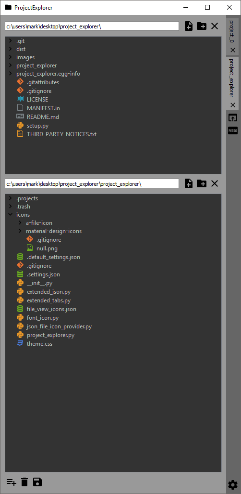

# project_explorer
A simple file browser that uses project based concepts.

Each tab represents a different project, and each project can have multiple roots open. A root is a folder that needs to be viewed to work on the project.



| Icon | Action |
|  | Open Project |

## Installation

Currently developed for Windows and requires Python 2.7.

Install with pip:

```bash
pip install project_explorer
```

## Running

To create a Windows desktop shortcut, Right Click->New->Shortcut and set the location to:

```
pythonw.exe -m project_explorer.project_explorer
```

## Keyboard Shortcuts

| Action               | Keys                            |
| -------------------- | ------------------------------- |
| Autocomplete Path    | <kbd>Tab</kbd>                  |
| Copy File/Directory  | <kbd>Ctrl</kbd>+<kbd>C</kbd>    |
| Paste File/Directory | <kbd>Ctrl</kbd>+<kbd>V</kbd>    |
| Trash Selected       | <kbd>Del</kbd>                  |
| Delete Selected      | <kbd>Shift</kbd>+<kbd>Del</kbd> |
